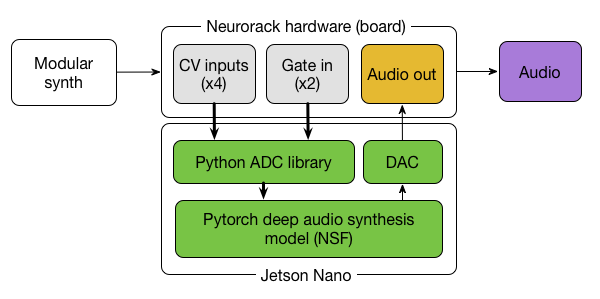

# Neurorack

The full scientific paper associate to this project is available [here](https://infoscience.epfl.ch/record/291222).

This project documents the Neurorack, which is a deep AI-based synthesizer based on the Jetson Nano development kit in a EuroRack format. The following diagram briefly explains the overall structure of the module and the relations between the hardware and software (green) components.

  

The hardware part features 4 CV and 2 Gates (along with a screen, rotary and button for handling the menus), which all communicate with specific Python libraries. Note that the behavior of these controls (and the module itself) is highly dependent on the type of deep model embedded. For this first version of the Neurorack, we implemented a descriptor-based impact sounds generator, described in the software section, later in this document.

Everything in this project is under the [CC NC-BY-SA 4.0](https://creativecommons.org/licenses/by-nc-sa/4.0/) licence, which means you can adapt, share, tweak, dance with, destroy anything here as long as there is no commercial use involved.

## Hardware

You can find in the [`board/`](https://github.com/ninon-io/Impact-Synth-Hardware/tree/main/board) folder the board design and different schematics for wiring the hardware prototype. More detailed informations and tips are available in the [wiki](https://github.com/ninon-io/Impact-Synth-Hardware/wiki). We provide here just a quick BOM to help out.

### Bill Of Materials (BOM)

- [Jetson Nano developer kit](https://developer.nvidia.com/embedded/jetson-nano-developer-kit)
- [Digital Analog Converter (DAC)](https://www.amazon.fr/HiLetgo-Lossless-Digital-Converter-Raspberry/dp/B07QBY5Y9K/ref=sr_1_3?__mk_fr_FR=%C3%85M%C3%85%C5%BD%C3%95%C3%91&crid=2DYQJGKHO7EWZ&dchild=1&keywords=pcm5102&qid=1611491039&sprefix=pcm%2Caps%2C174&sr=8-3)
- [Analog-Digital Converter (ADC) - Pimoroni ADS1015](https://shop.pimoroni.com/products/ads1015-adc-breakout)
- [Screen - Pimoroni LCD (240x240)](https://shop.pimoroni.com/products/1-3-spi-colour-lcd-240x240-breakout)
- [Rotary Encoder - Pimoroni RGB Breakout](https://shop.pimoroni.com/products/rgb-encoder-breakout)
- [Jack Connectors (x6)](https://www.amazon.fr/PsmGoodsJack-st%C3%A9r%C3%A9o-Connecteur-montage-panneau/dp/B01MYMXWUK/ref=sr_1_17_sspa?__mk_fr_FR=%C3%85M%C3%85%C5%BD%C3%95%C3%91&dchild=1&keywords=embase%2Bmini%2Bjack%2B%C3%A0%2Bsouder&qid=1611491231&sr=8-17-spons&spLa=ZW5jcnlwdGVkUXVhbGlmaWVyPUEyODFaS0JER000RVFSJmVuY3J5cHRlZElkPUEwNjM4NTIwVlJYUFQ5UTBOWTFFJmVuY3J5cHRlZEFkSWQ9QTA5MTk3NTJDM1ozRzVaWFk0TU8md2lkZ2V0TmFtZT1zcF9tdGYmYWN0aW9uPWNsaWNrUmVkaXJlY3QmZG9Ob3RMb2dDbGljaz10cnVl&th=1)
- [40pins jumper cable](https://www.amazon.fr/Vipmoon-Dupont-Breadboard-Jumper-C%C3%A2bles/dp/B07BLRNTXW/ref=sr_1_15?__mk_fr_FR=%C3%85M%C3%85%C5%BD%C3%95%C3%91&crid=XB3BR25O7K7T&dchild=1&keywords=nappe+40+pin&qid=1611491473&sprefix=nappe+40+%2Caps%2C165&sr=8-15)
- [40pins connector kit (fc40p)](https://www.amazon.fr/Ctzrzyt-Double-rangee-Connecteur-Femelle/dp/B08PP7YYVF/ref=sr_1_1?dchild=1&keywords=fc40p&qid=1611492342&sr=8-1)
- [Soldering header pins kit](https://www.amazon.fr/2-54mm-Breakable-Connector-Arduino-PIN-6C-60PCS/dp/B01MQ5HJYQ/ref=sr_1_6?__mk_fr_FR=%C3%85M%C3%85%C5%BD%C3%95%C3%91&dchild=1&keywords=pin%2Bheader&qid=1611492112&sr=8-6&th=1)

## Software

You can find in the [`code/`](https://github.com/ninon-io/Impact-Synth-Hardware/tree/main/code) folder all the necessary Python code for running the Neurorack, along with the deep model based on a modified Neural Source-Filter (NSF) architecture. At this time, the first CV controls interpolation between different points of the latent descriptor space, and the three remaining CVs directly control high-level descriptors (loudness, centroid, inharmonicity). The first gate is used to output the corresponding current impact.

## Demonstration video

You can find our cryptic demonstration video on YouTube

[https://www.youtube.com/watch?v=64VpQenCHVs](https://www.youtube.com/watch?v=64VpQenCHVs)

## Bibliography

* Esling, P., & Devis, N. (2020). [Creativity in the era of artificial intelligence.](https://arxiv.org/pdf/2008.05959). Keynote paper at the JIM Conference 2020 arXiv preprint arXiv:2008.05959.
* Esling, P., Devis, N., Bitton, A., Caillon, A., & Douwes, C. (2020). [Diet deep generative audio models with structured lottery.](https://arxiv.org/pdf/2007.16170) International Digital Audio Effects (DaFX 2020) Conference. arXiv preprint arXiv:2007.16170.
